<div align="center">

# 🏋️‍♂️ Home Workout Planner — Frontend

**A modern fitness web app for consistent home workouts — no gym required.**

[](https://react.dev/)
[](https://vitejs.dev/)
[](https://tailwindcss.com/)
[](https://firebase.google.com/)
[](https://ui.shadcn.com/)

🌍 **Live Demo:** [https://cosmic-paletas-3425dc.netlify.app](https://cosmic-paletas-3425dc.netlify.app)  
🔗 **Backend API:** [https://home-workout-planner.onrender.com](https://home-workout-planner.onrender.com)

</div>

---

## 📖 About

Home Workout Planner is a **React 19** fitness web application that helps users build consistent workout habits at home.

It provides auto-generated routines, adaptive intensity levels, progress tracking, reminders, and nutrition guidance — all without requiring any gym equipment.

---

## ✨ Features

| Feature | Description |
|---------|-------------|
| 🏠 **Equipment-Free Workouts** | All exercises designed for home use |
| 🤖 **Auto-Generated Plans** | Personalized plans based on fitness goal & level |
| 🎥 **Exercise Video Tutorials** | YouTube tutorial links for every exercise |
| 📊 **Performance Tracker** | Charts and history for workout progress |
| 🔔 **Daily Reminders** | Push notification reminders via Firebase |
| 📈 **Adaptive Intensity** | Plans adjust based on performance |
| 🥗 **Nutrition Planning** | Goal-based meal plans with Indian vegetarian recipes |
| ⏱️ **Exercise Timer** | Built-in interval and rest timers |
| 🧘 **Recovery Guidance** | Rest day and wellness recommendations |

---

## 🛠️ Tech Stack

| Category | Technology |
|----------|------------|
| **Framework** | React 19 + Vite 7 |
| **Styling** | Tailwind CSS v4 + shadcn/ui |
| **Icons** | Lucide React |
| **Routing** | React Router DOM v7 |
| **Charts** | Recharts |
| **HTTP Client** | Axios |
| **Notifications** | Sonner + Firebase |
| **Services** | Firebase (Push Notifications) |

---

## ⚙️ Installation & Setup

### 1. Clone the Repository

```bash
git clone https://github.com/G-Kangutkar/home-workout-planner-frontend.git
cd home-workout-planner-frontend
```

### 2. Install Dependencies

```bash
npm install
```

### 3. Configure Environment Variables

Create a `.env` file in the root directory:

```env
VITE_API_BASE_URL=your_backend_url

VITE_FIREBASE_API_KEY=your_firebase_api_key
VITE_FIREBASE_AUTH_DOMAIN=your_firebase_auth_domain
VITE_FIREBASE_PROJECT_ID=your_firebase_project_id
VITE_FIREBASE_MESSAGE_SENDER=your_firebase_sender_id
VITE_FIREBASE_APP_ID=your_firebase_app_id
VITE_FIREBASE_VAPID_KEY=your_firebase_vapid_key
```

### 4. Start the Development Server

```bash
npm run dev
```

> App runs at `http://localhost:5173`

---

## 📁 Project Structure

```
src/
 ├── components/       # Reusable UI components
 ├── pages/            # Route-level page components
 ├── constants/        # Static data and config constants
 ├── firebase/         # Firebase initialization & messaging
 ├── lib/              # Utility functions and helpers
 ├── App.jsx           # Root app component with routing
 └── main.jsx          # Entry point
```

---

## 📸 Screenshots

### 🔐 Authentication

<table>
<tr>
<td align="center">
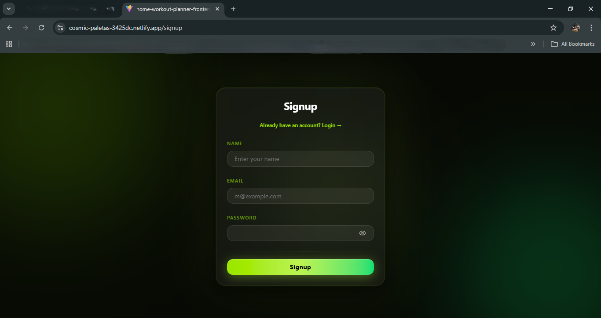<br/>
<b>📝 Sign Up</b>
</td>
<td align="center">
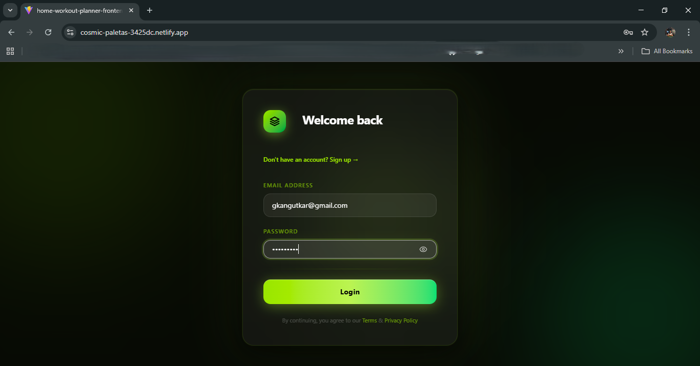<br/>
<b>🔐 Login</b>
</td>
</tr>
</table>

---

### 👤 Profile Setup

<table>
<tr>
<td align="center">
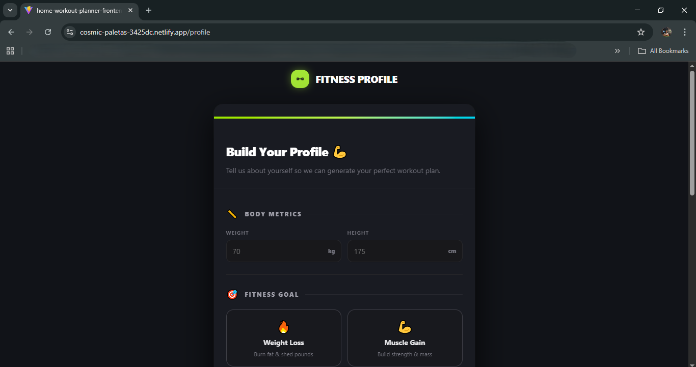<br/>
<b>Step 1 — Goals</b>
</td>
<td align="center">
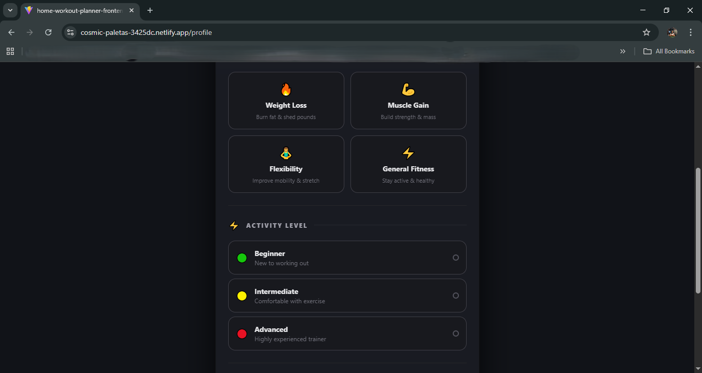<br/>
<b>Step 2 — Fitness Level</b>
</td>
</tr>
<tr>
<td align="center">
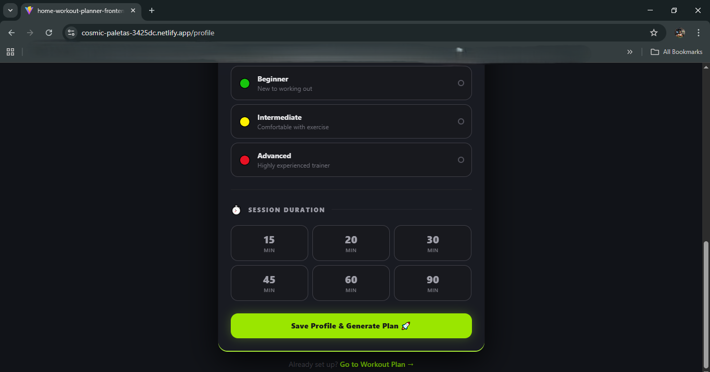<br/>
<b>Step 3 — Body Stats</b>
</td>
<td align="center">
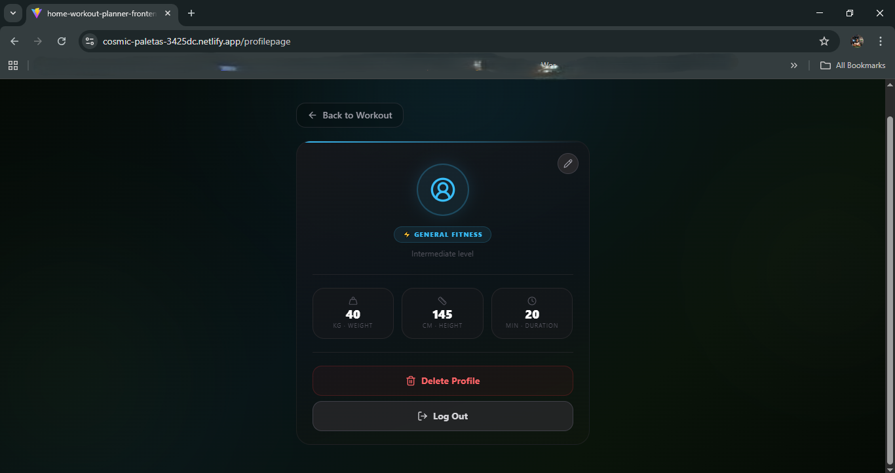<br/>
<b>👤 Profile Overview</b>
</td>
</tr>
</table>

---

### 📅 Workout Dashboard

<table>
<tr>
<td align="center">
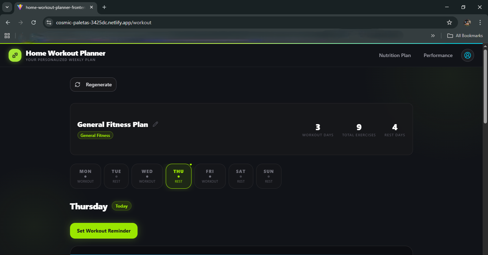<br/>
<b>Weekly Plan View</b>
</td>
<td align="center">
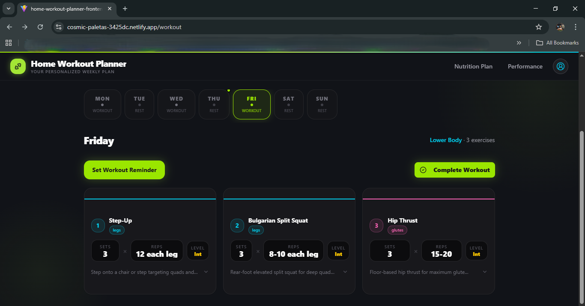<br/>
<b>Exercise Card</b>
</td>
</tr>
<tr>
<td align="center" colspan="2">
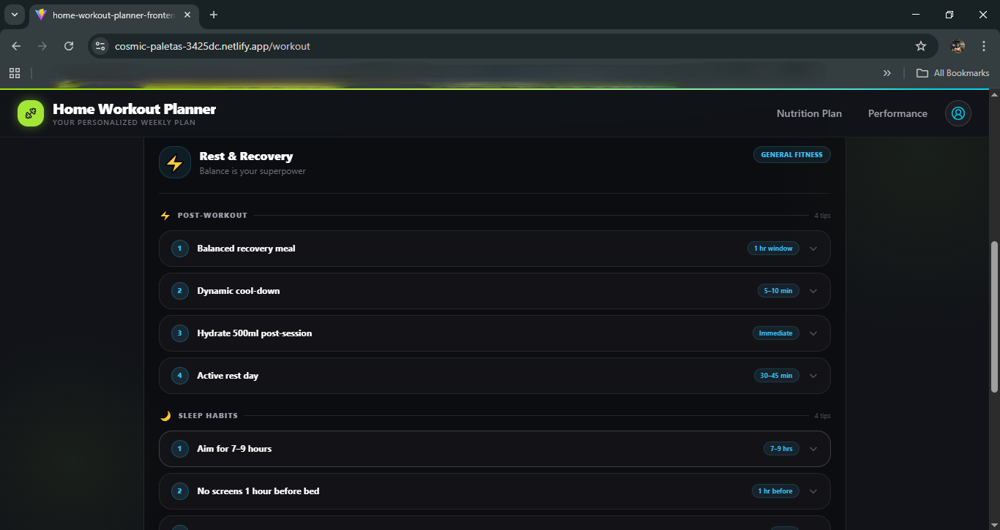<br/>
<b>🛌 Rest Day Card</b>
</td>
</tr>
</table>

---

### 📊 Performance Tracker

<table>
<tr>
<td align="center">
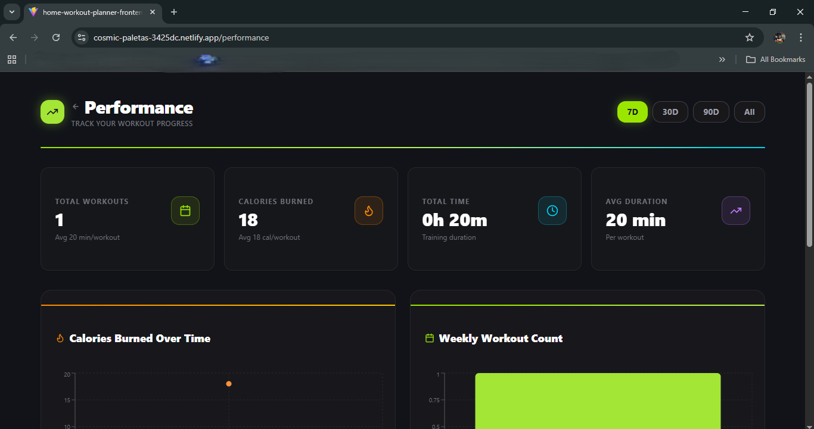<br/>
<b>Progress Charts</b>
</td>
<td align="center">
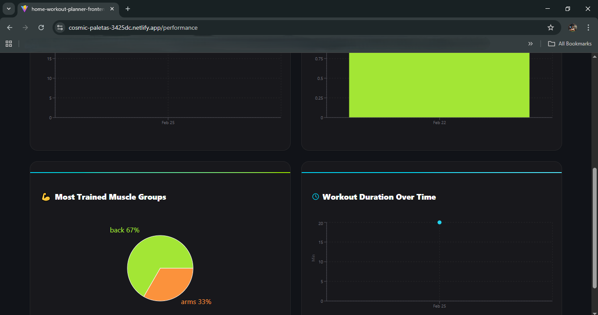<br/>
<b>Workout History</b>
</td>
</tr>
</table>

---

### 🥗 Nutrition & More

<table>
<tr>
<td align="center">
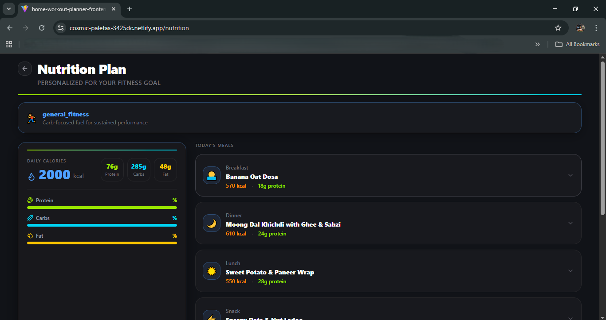<br/>
<b>Meal Plan Overview</b>
</td>
<td align="center">
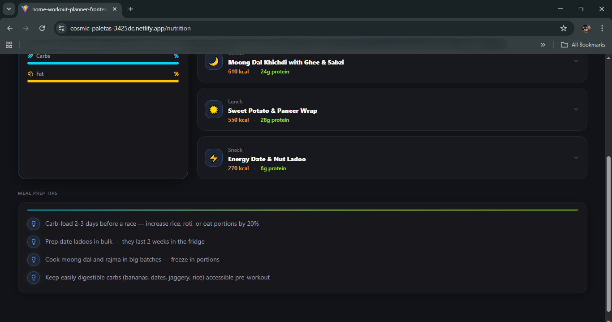<br/>
<b>Meal Details & Recipes</b>
</td>
</tr>
<tr>
<td align="center">
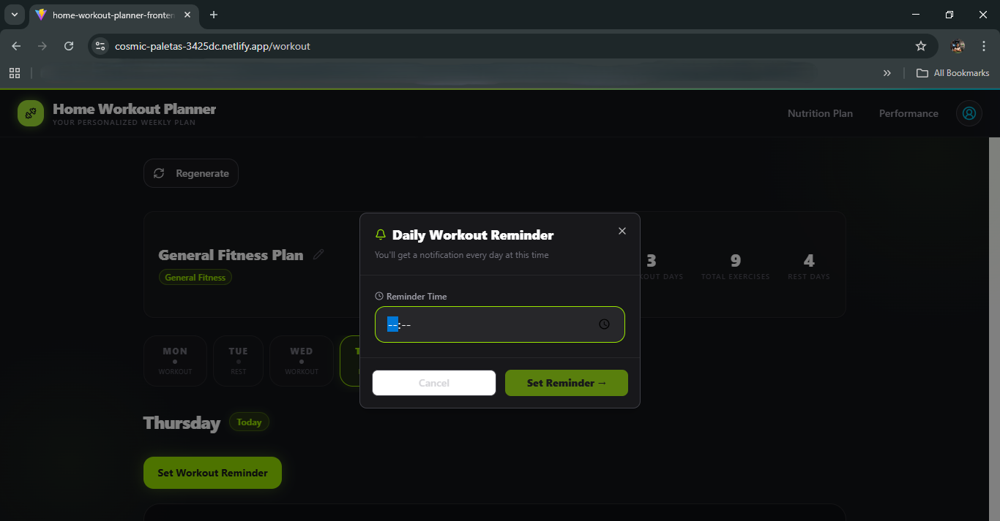<br/>
<b>🔔 Workout Reminders</b>
</td>
<td align="center">
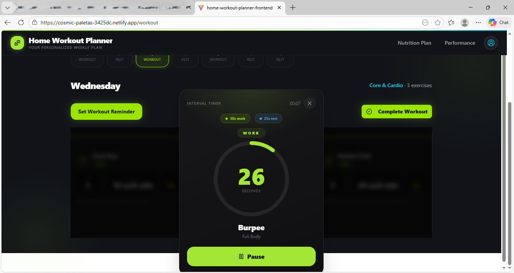<br/>
<b>⏱️ Exercise Timer</b>
</td>
</tr>
</table>

---

## 🔗 Related Repository

> 🔧 **Backend API:** [Home Workout Planner — Backend](https://github.com/G-Kangutkar/Home-Workout-Planner)

---

<div align="center">

Built with ❤️ using React 19 + Vite + Tailwind CSS

</div>